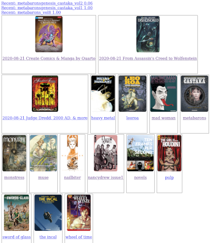

# Personal Book Library

Raison D'être: I routinely buy comic books from humblebundle.com, and want to read them on my e-reader at home and on my phone when I'm away. Side loading my e-reader is a pain, and I don't want to self manage which book is downloaded where, or which page I was on last.

 

# Features

* Supports .cbz, extracted .cbz, .mobi and .epub.
* Supports organizing books in a folder hierarchy.
* Supports per user progress tracking.

# Backburner (a.k.a. won't do [probably])

* Convert on the fly epub / mobi from one another.
	* I use to run ebook-convert, but it's really slow on a rasberry pi, which is where I host. At that point, I prefer to run it on my PC manually.